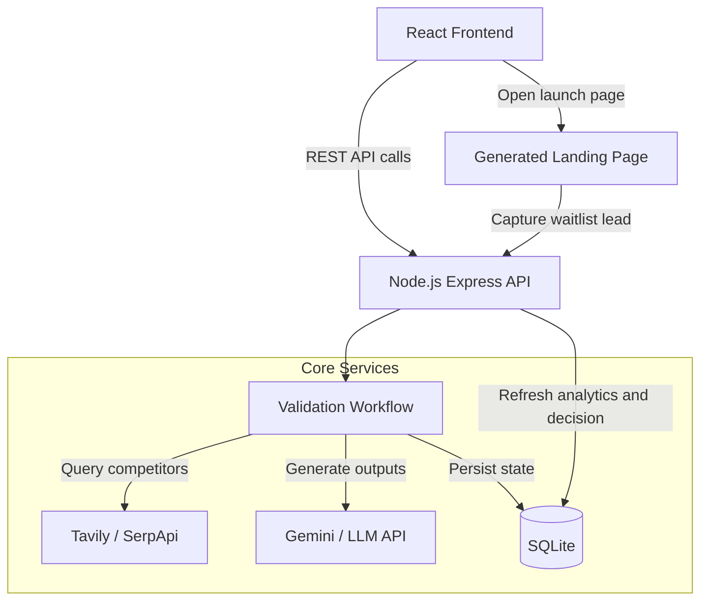

# System Architecture

ValidationEngine is split into a React + Vite frontend and a Node.js + Express backend.

## High-Level Flow

## Frontend

- Single frontend lives in `frontend/`
- React Router handles landing, dashboard, auth, profile, and content routes
- Vite handles local development and production builds
- Vercel runtime config injects the backend base URL for deployed environments

## Backend

- `validationWorkflow`: orchestrates research, hypothesis, landing page, and decision generation
- `authService`: handles sign-up, sign-in, verification, and profile updates
- `researchService`: interfaces with search providers
- `landingPageService`: builds the public launch page
- `decisionService`: scores outcomes from current evidence
- `validationStore`: persists validation state in SQLite
